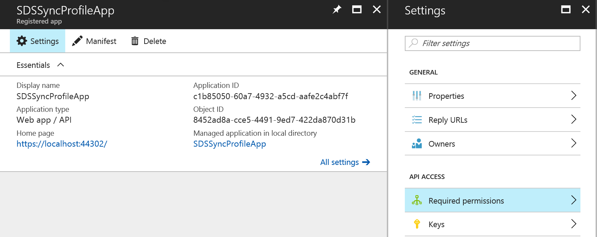
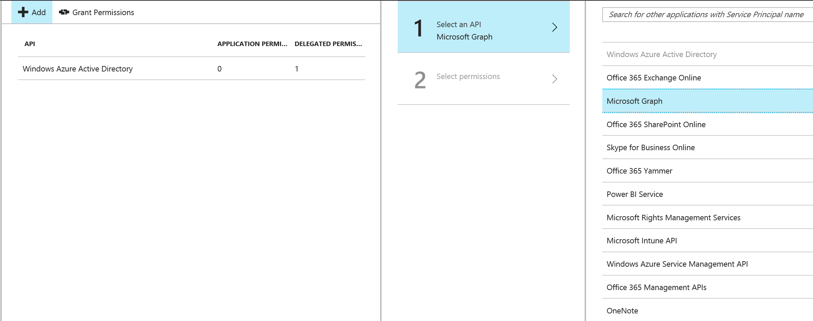

# School Data Sync Profile APIs Preview

**This document provides information on setting up automated sync and profile management using the Preview version of [School Data Sync Profile Management APIs](../api/synchronizationProfile_create.md)**

Background: [School Data Sync](https://sds.microsoft.com/) helps to automate the process of importing and synchronizing roster and account data from student information systems around the world with Azure AAD and Office 365. A synchronization profile is a representation of a configuration that is used for syncing the data. To setup the sync, school IT can chose to login to the SDS portal and create a sync profile and chose a deployment method – either using CSV files or one of the supported SIS connectors or a OneRoster compliant.  In addition to enabling sync from the portal you can also use School Data Sync APIs to manage the sync process. This document describes how SDS Management APIs can be used to fully automate SDS profile and sync management without using the SDS Management portal.

Explore School Data Sync profile management APIs:
-  [Create an SDS Profile for SDS Sync using CSV files](SDSCreateProfile.md)
-  [Create an SDS Profile for SDS Sync using OneRoster or a supported SIS API Provider](SDSCreateProfileAPI.md)
-  [Updating an existing sync profile](UpdateSyncProfiles.md)
-  [Troubleshooting sync failures](TroubleshootingSyncFailures.md)

## Prerequisites:

### Prerequisites for developing the Sync Profile App:
School Data Sync Profile APIs can be integrated with a 3rd party app or a student information system (SIS) solution. To enable this integration, the app must meet the
the following prerequisites:

1. The Client App is registered with Azure Active Directory.

    To create an app that can be used by multiple EDU tenants, the recommendation is to build a multi-tenant SaaS web application using Azure AD and OpenId Connect. Following the guidelines and a sample app published [here](https://docs.microsoft.com/en-us/azure/active-directory/develop/active-directory-devhowto-multi-tenant-overview) to register this app with Azure AD.

2.. Request permissions in the app to manage synchronization profiles.

  To enable the app to create and manage synchronization profiles, the app needs to request permissions mentioned below in Azure AAD. The school IT admin will be responsible for granting these permissions.

  - Navigate to the newly registered app in Azure portal, go to app settings and select 'Required Permissions'

       

  - Select 'Add' and chose 'Graph API'

      

  - Select one of the following 'delegated' permissions:
    - 'Manage education app settings'  - For scenarios that require read-write permissions
    - 'Read education app settings' - For scenarios that require read-only permissions.

    Please refer to the API documentation to identify the scopes for the corresponding APIs.

    

3. Authorization token needed to call the SDS APIs needs to be acquired in the user context. The resource the token is requested for should be "https://graph.microsoft.com".

### Prerequisites for running the App

Once the app is deployed, School IT can setup automated sync profiles. Here are the prerequisites for running the app.

1. Access to EDU Tenant Admin subscription: Ensure the IT admin has access to the Admin account of the EDU subscription. The IT admin needs to login to Azure portal (from Office admin center).

2. Grant the consent for permissions requested by the app : Login to the grant the permissions that are requested by the app to create and manage sync profiles.

Once you have successfully met the prerequisites for creating an app, you are ready to explore the scenarios supported the Sync Profile APIs.
